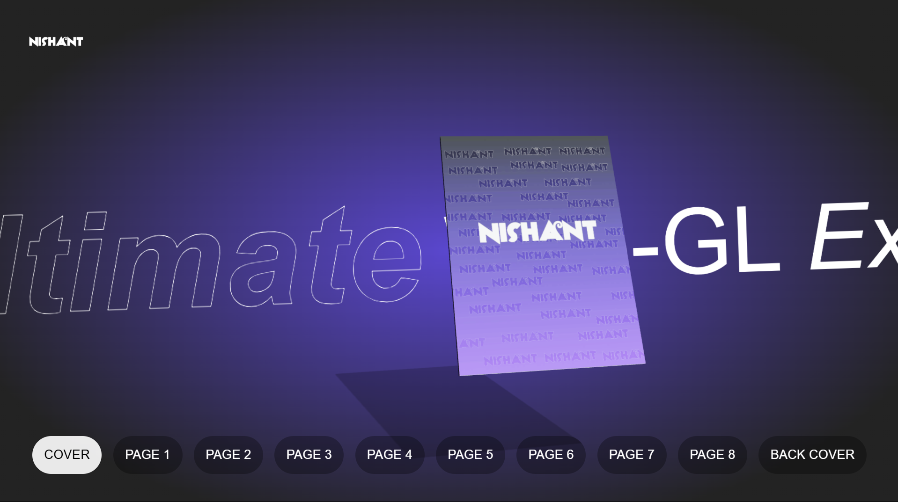

# 📘 3D Sliding Book

A visually engaging **3D Sliding Book** built using **React** and **Three.js**. This interactive project demonstrates realistic book animations, smooth page sliding, and immersive depth effects — making it ideal for digital portfolios, product showcases, or storytelling websites.

---

## 🔥 Features

- 📖 Smooth 3D page transitions
- 🌐 Built with React + Three.js + GSAP
- 💡 Realistic lighting and depth
- ⚙️ Highly customizable layout and interactions
- 🔁 Looping animations and interactive camera
- 🧩 Lightweight and responsive

---

## 🚀 Tech Stack

- **React** (Frontend UI)
- **Three.js** (3D rendering)
- **GSAP** (Page slide animations)
- **Vite / CRA / Next.js** (Choose based on your setup)

---

## 📁 Folder Structure

## Structure Explanation

### Public Assets

- `public/audio/` - Contains audio files used in the application
- `public/images/` - Stores image assets
- `public/textures/` - Houses texture files for graphical elements

### Source Code

- `src/components/` - Reusable React components
  - `Book.jsx` - Main book component
  - `Experience.jsx` - 3D/Interactive experience component
  - `UI.jsx` - User interface components
- `App.jsx` - Root application component
- `main.jsx` - Application entry point

### Configuration

- `vite.config.js` - Vite build configuration (or `next.config.js` for Next.js)
- `package.json` - Project metadata and dependencies
- `.gitignore` - Specifies intentionally untracked files
